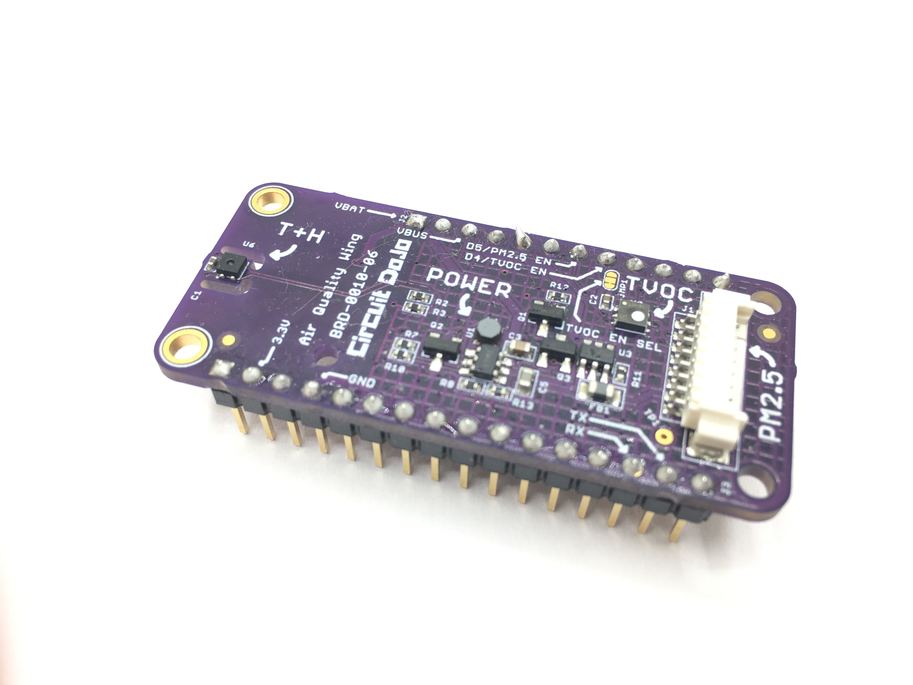

# Air Quality Wing Hardware

## What is it?

The Air Quality Wing, designed by [Jared Wolff](https://www.jaredwolff.com) aka Circuit Dojo, is an all-in-one air quality sensor for Feather based development boards. It brings together a trio of sensors to give you as many data points as possible. That way, there won’t be anything missing when you go to measure the air inside your home or workplace.

Here’s what’s on board:

### Particulate Sensing

The Air Quality Wing also has support for the **Honeywell HPMA115S0 dust sensor**. This sensor counts the concentration of potentially harmful particulates in the air. Plus, it does it all using ***lasers.***

It can detect both large particles 10µm in diameter and smaller ones less than 2.5µm in diameter. These are the same readings that are commonly known as PM10 and PM2.5.

### Sensing Volatile Compounds

Second to that, is the **Sensirion SGP40**. This senses volatile organic compounds and eC02. These types of readings are useful in places where there may be combustion. (Think stoves, furnaces, etc) It can act as an early warning mechanism. That way you stay safe, happy and healthy!

### Temperature and Humidity

Finally, the **Sensirion SHTC** temperature and humidity sensor. These readings can be used on their own. Additionally they’re used by the SGP40 to compute an accurate TVOC.

### Flexible Power Sources

No outlet nearby where you want to measure? No problem!

You can easily plug in almost any lithium polymer battery to your Feather based board and use it immediately. The Air Quality Wing has extra circuitry that allow you to use either USB or battery power. How great is that?

[To get yours go here.](https://www.jaredwolff.com/store/air-quality-wing/)

## Library/Code

Here is is the links for the [Zephyr example code](https://github.com/circuitdojo/air-quality-wing-zephyr-demo). Here's the [Rust code](https://github.com/circuitdojo/air-quality-wing-rust-demo). The Rust code is a work in progress.

## Changelog

## v6 - (October 2021)

**Changed:**

* Formfactor to standard Feather size
* Replaced temperature/humidity sensor with SHTC3
* Replaced TVOC sensor with SGP40
* Changed MCP1640 package to DSON from SOT23-5
* Hatched ground planes on both top and bottom
* Re-designed sensor placement
* Thermal isolation slots for SHTC3
* Pinout for PM2.5 connector reverted back to original design (allows for bidirectional use of cable)

**Added:**

* Added I2C power control to D4
* Added battery backpack (CR2 holder)

## v4

- Relocated the Si7021 to a separate "lily pad" for heat isolation

## v3

- Fixed bug related supply voltage not being stable to the HPMTA115S0
- Relocated D7 to D5 for CCS811 reset signal
- Changed connector pinout. That way the cable does't have to be twisted.

## v2

- Added ferrite to shunt noise
- Swapped out MCP1624 with MCP1640

## License

Hardware released under the CERN Open Hardware Licence Version 2 - Weakly Reciprocal. See **LICENSE** for more info.
