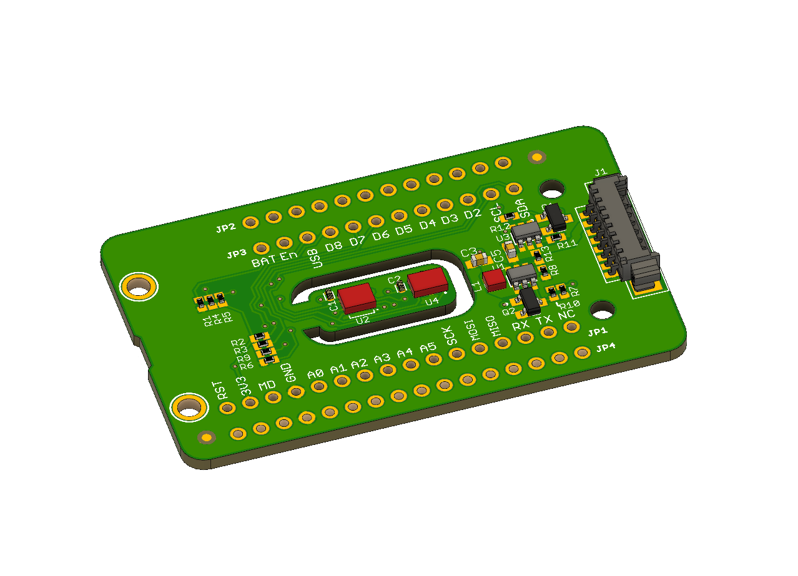

# Particle Squared

Particle^2 (pronounced Particle Squared) is a circuit board that helps you monitor the air quality around you. This repository is the Eagle Files for Particle^2 which enables you to monitor humidity, temperature, air particulates, eC02 and TVOCs in one small package. You can use it with an Adafruit Feather compatible board or the newest mesh enabled boards from Particle. [For more information click here.](https://www.jaredwolff.com/particle-squared-air-quality-sensor/)

[To get yours go here.](https://www.jaredwolff.com/store/particle-squared/)

## License

The license for these files is: [Attribution-ShareAlike 4.0 International](https://creativecommons.org/licenses/by-sa/4.0/). See included `LICENSE` file for all the legal stuff.